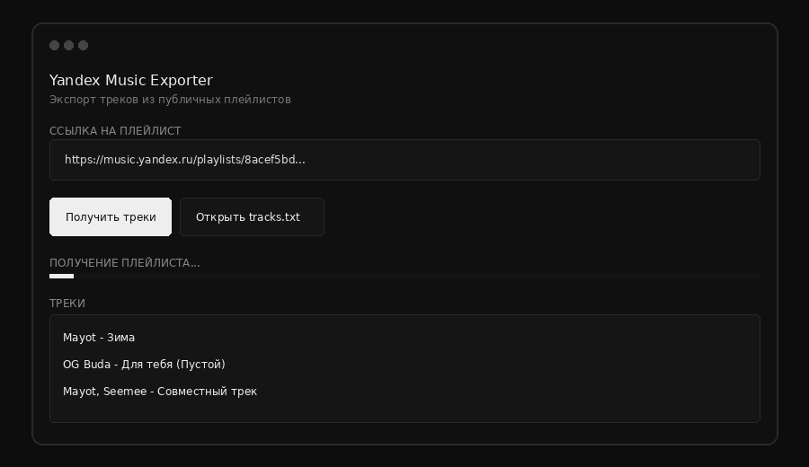

# Yandex Music Exporter

<p align="center">
  
</p>

<p align="center">
  <b>Экспорт треков из публичных плейлистов Яндекс Музыки</b>
</p>

<p align="center">
  
  
  
  
</p>

---

## О проекте

**Yandex Music Exporter** - небольшая утилита на Python для выгрузки списка треков из публичных плейлистов Яндекс Музыки.

Результат сохраняется в `tracks.txt`:

```text
Mayot - Зима
OG Buda - Для тебя (Пустой)
Mayot, Seemee - Совместный трек
```

Порядок треков сохраняется. Дубликаты не удаляются.

---

## Важно: плейлист должен быть открыт

> [!IMPORTANT]
> **Плейлист должен быть публичным.**

Программа работает с открытыми плейлистами. Если плейлист приватный, API не сможет получить его содержимое без авторизации.

Перед экспортом отключите приватность плейлиста в Яндекс Музыке и убедитесь, что он доступен по ссылке.

```text
Приватный плейлист
       ↓
Отключить приватность
       ↓
Публичный плейлист
       ↓
Скопировать ссылку
       ↓
Вставить в Yandex Music Exporter
```

---

## Возможности

- обычные ссылки на публичные плейлисты;
- ссылки с query-параметрами;
- iframe-код Яндекс Музыки;
- несколько исполнителей через запятую;
- сохранение исходного порядка;
- сохранение дубликатов;
- UTF-8 без BOM;
- графический интерфейс;
- CLI;
- повторные HTTP-запросы при временных ошибках;
- таймаут запросов;
- просмотр результата в GUI;
- копирование выбранных строк двойным кликом.

---

## Интерфейс

<p align="center">
  
</p>

Тёмный интерфейс работает на стандартном `Tkinter`, без тяжёлых GUI-фреймворков.

---

## Установка

Требуется Python 3.10 или новее.

```bash
pip install -r requirements.txt
```

`Tkinter` входит в стандартную библиотеку Python.

### Linux

Если `Tkinter` отсутствует:

```bash
sudo apt install python3-tk
```

---

## Запуск

### GUI

```bash
python main.py
```

Дальше:

1. Откройте доступ к плейлисту.
2. Скопируйте ссылку.
3. Вставьте её в поле.
4. Нажмите **Получить треки**.
5. Дождитесь окончания экспорта.
6. Откройте `tracks.txt`.

### CLI

```bash
python main.py "https://music.yandex.ru/playlists/8acef5bd-cd42-d404-b6d3-bea3d35390f5?utm_source=desktop&utm_medium=copy_link"
```

---

## Примеры ссылок

### Публичная ссылка

Используемый пример публичного плейлиста:

```text
https://music.yandex.ru/playlists/8acef5bd-cd42-d404-b6d3-bea3d35390f5?utm_source=desktop&utm_medium=copy_link
```

Запуск через CLI:

```bash
python main.py "https://music.yandex.ru/playlists/8acef5bd-cd42-d404-b6d3-bea3d35390f5?utm_source=desktop&utm_medium=copy_link"
```

### iframe

Пример iframe-кода Яндекс Музыки:

```html
<iframe frameborder="0" allow="clipboard-write" style="border:none;width:614px;height:556px;" width="614" height="556" src="https://music.yandex.ru/iframe/playlist/cr3ature.d.creature/1183">Слушайте <a href="https://music.yandex.ru/playlists/8acef5bd-cd42-d404-b6d3-bea3d35390f5?utm_source=desktop&utm_medium=copy_link">need 4 speed / music 4 car</a> - <a href="https://music.yandex.ru/users/cr3ature.d.creature">teronlyone</a> на Яндекс Музыке</iframe>
```

Программа принимает iframe как входные данные, если внутри него присутствует ссылка на плейлист.

---

## Формат результата

Файл:

```text
tracks.txt
```

Кодировка:

```text
UTF-8
```

BOM отсутствует.

Формат строки:

```text
Исполнитель - Название трека
```

Если исполнителей несколько:

```text
Исполнитель 1, Исполнитель 2 - Название трека
```

Дубликаты сохраняются:

```text
Mayot - Зима
OG Buda - Для тебя
Mayot - Зима
```

---

## Структура проекта

```text
yandex-music-exporter/
│
├── app/
│   ├── __init__.py
│   ├── cli.py
│   ├── config.py
│   ├── exporter.py
│   ├── gui.py
│   └── yandex.py
│
├── assets/
│   ├── banner.gif
│   └── gui.gif
│
├── .gitignore
├── LICENSE
├── README.md
├── main.py
└── requirements.txt
```

---

## Как это работает

Программа извлекает идентификатор плейлиста из URL:

```text
/playlists/...
```

Затем получает данные через JSON API Яндекс Музыки и извлекает название трека и имена исполнителей.

Для каждого трека формируется строка:

```text
Artist 1, Artist 2 - Track title
```

После этого строки сохраняются в `tracks.txt`.

---

## Обработка ошибок

При временных HTTP-ошибках программа выполняет повторные запросы.

Обрабатываются, в частности:

```text
429
500
502
503
504
```

Также используется таймаут HTTP-запросов.

Если API сообщает о большем количестве треков, чем реально вернуло, программа не создаёт неполный результат и сообщает об ошибке.

---

## Почему без Selenium и Playwright

Для публичного плейлиста браузер не требуется. Программа получает данные напрямую через JSON API.

Поэтому проекту не нужны:

```text
Chrome
Chromium
Firefox
WebDriver
Selenium
Playwright
```

Это уменьшает количество зависимостей и ускоряет запуск.

---

## Ограничения

> [!NOTE]
> Проект работает с публичными плейлистами.

Приватные плейлисты без авторизации недоступны.

Внутренний API Яндекс Музыки может измениться. В таком случае потребуется обновить `app/yandex.py`.

---

## Лицензия

MIT License.

Перед использованием проекта убедитесь, что ваши действия соответствуют условиям использования Яндекс Музыки и применимому законодательству.

---

<p align="center">
  
</p>

<p align="center">
  <sub>Yandex Music Exporter</sub>
  <br>
  <sub>Local utility for exporting public playlists</sub>
</p>
